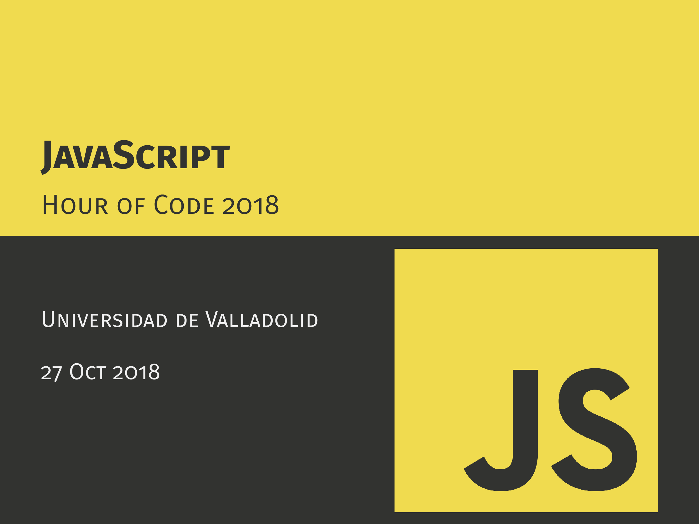

# Hour of Code 2018: JavaScript & TypeScript

## Introducción
Taller de iniciación a JavaScript y TypeScript para el Hour of Code 2018, organizado en la Universidad de Valladolid.

[Link a la pagina del evento en la UVa](http://eventos.uva.es/27587/detail/la-hora-del-codigo-2018.html)

## Links útiles

## Créditos

- Carlos Gómez ([@Kurolox](https://github.com/Kurolox))
- Pablo Valdunciel ([@pabvald](https://github.com/pabvald))